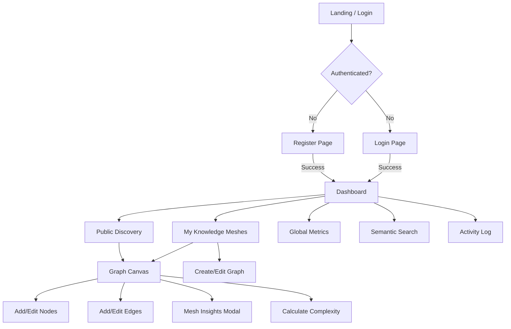
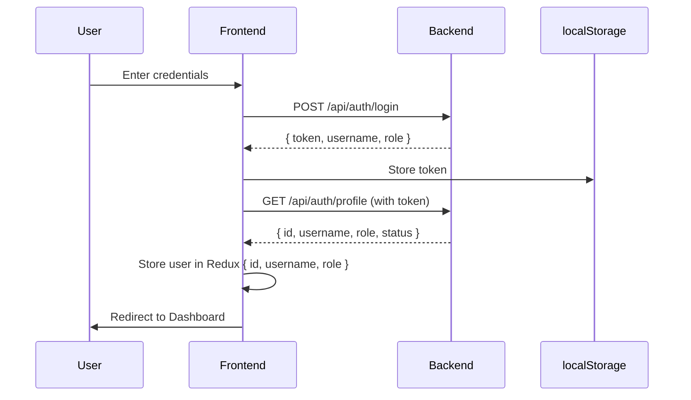
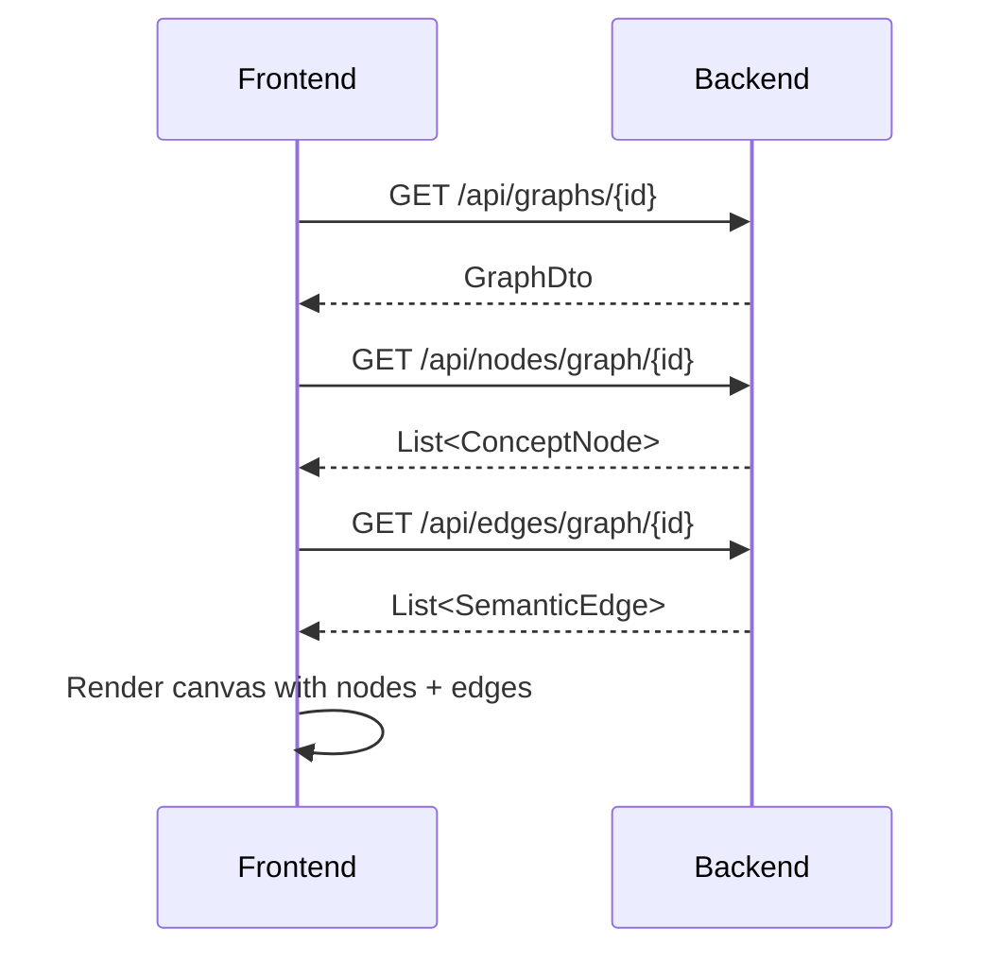
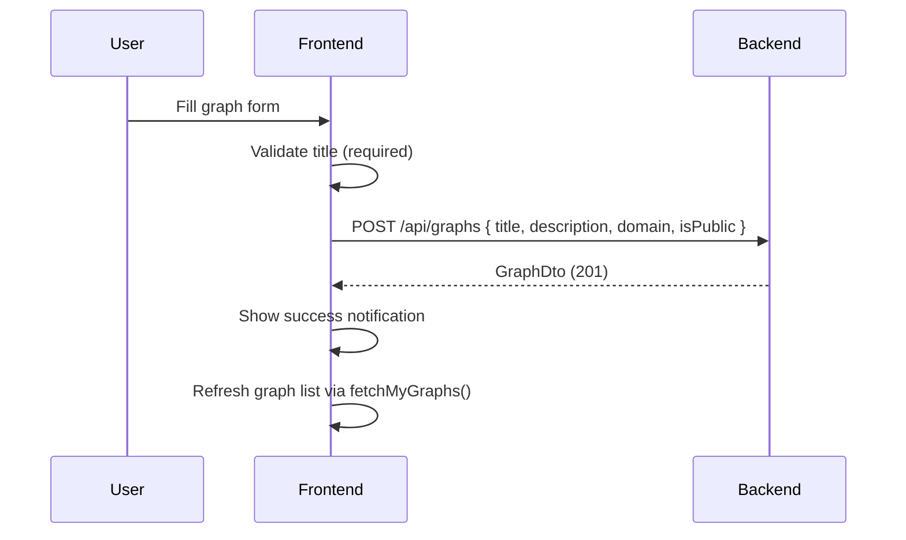

# MindMesh — Frontend Development Plan & Backend API Analysis

> **Status**: Planning only — no code changes proposed  
> **Date**: 2026-08-28  
> **Baseline rule**: The backend passes all existing tests. Every proposed backend change is assessed for backward-compatibility risk.

---

## Table of Contents

1. [Current State Assessment](#1-current-state-assessment)
2. [User Journeys & Navigation Flow](#2-user-journeys--navigation-flow)
3. [Page/Screen Inventory](#3-pagescreen-inventory)
4. [Frontend → API Endpoint Mapping](#4-frontend--api-endpoint-mapping)
5. [Backend API Gap Analysis](#5-backend-api-gap-analysis)
6. [DTO & Data Contract Assessment](#6-dto--data-contract-assessment)
7. [Validation, Pagination, Search & Error Handling](#7-validation-pagination-search--error-handling)
8. [Role-Based Access & Permission Matrix](#8-role-based-access--permission-matrix)
9. [Frontend Architecture Decisions](#9-frontend-architecture-decisions)
10. [Backend Improvement Recommendations](#10-backend-improvement-recommendations)
11. [Risk Register](#11-risk-register)
12. [Prioritized Implementation Roadmap](#12-prioritized-implementation-roadmap)

---

## 1. Current State Assessment

### Backend (✅ Complete & Tested)

The Spring Boot backend is fully implemented with:

| Layer | Status | Components |
|---|---|---|
| Controllers | ✅ Complete | Auth, Graph, Node, Edge, Collaboration, Insight (6 controllers) |
| Services | ✅ Complete | Auth, GraphOrchestrator, SpatialLogic, Collaboration, Insight (5 services) |
| Entities | ✅ Complete | SystemAccount, KnowledgeGraph, ConceptNode, SemanticEdge, ActivityLog, CollaborationInvite |
| DTOs | ⚠️ Partial | AuthRequestDto, RegisterRequestDto, AuthResponseDto, GraphDto (4 DTOs — nodes/edges/collab return raw entities) |
| Repositories | ✅ Complete | 6 repositories with custom queries |
| Security | ✅ Complete | JWT (HS256), role-based SecurityConfig, JwtRequestFilter |
| Events | ✅ Complete | GraphComplexityEvent + ComplexityEventListener |
| Seeder | ✅ Complete | admin (STRATEGIST) + analyst (ANALYST) accounts |

**Total API Endpoints: 17**

### Frontend (🔴 Not Started)

The frontend is a **bare Create React App scaffold**:
- Only default CRA files exist (`App.js`, `index.js`, etc.)
- **No components, services, store slices, or routing** have been created
- **No dependencies installed** (no Redux, React Router, Axios, etc.)
- Everything specified in the SRS frontend sections (§15–§17) must be built from scratch

---

## 2. User Journeys & Navigation Flow

### 2.1 Primary User Journeys



### 2.2 Journey: New User Registration & First Graph

| Step | Screen | Action | API Call |
|---|---|---|---|
| 1 | Register | Fill form, submit | `POST /api/auth/register` |
| 2 | Dashboard | View empty state, stats | `GET /api/insights/stats` |
| 3 | My Meshes | Click "+ Create New Mesh" | — |
| 4 | Graph Form | Fill title, description, toggle public | `POST /api/graphs` |
| 5 | Graph Canvas | Add nodes to canvas | `POST /api/nodes/validate-layout/{graphId}` |
| 6 | Graph Canvas | Connect nodes with edges | `POST /api/edges` |
| 7 | Graph Canvas | Calculate complexity | `POST /api/graphs/{id}/calculate-complexity` |
| 8 | Mesh Insights | View complexity score, node/edge counts | (computed from local state or fetched) |

### 2.3 Journey: Analyst Browsing Public Graphs

| Step | Screen | Action | API Call |
|---|---|---|---|
| 1 | Login | Enter credentials | `POST /api/auth/login` |
| 2 | Dashboard | View platform stats | `GET /api/insights/stats` |
| 3 | Discovery | Browse public meshes | `GET /api/graphs/public` |
| 4 | Search | Search across meshes | `GET /api/graphs/search?query=...` |
| 5 | Graph Canvas | Open and view graph read-only | `GET /api/graphs/{id}`, `GET /api/nodes/graph/{id}`, `GET /api/edges/graph/{id}` |

### 2.4 Journey: Strategist Managing Graphs

| Step | Screen | Action | API Call |
|---|---|---|---|
| 1 | My Meshes | View paginated list | `GET /api/graphs/my` |
| 2 | My Meshes | Edit graph metadata | `PUT /api/graphs/{id}` |
| 3 | My Meshes | Delete graph | `DELETE /api/graphs/{id}` |
| 4 | Activity Log | Review actions | `GET /api/graphs/activity` |
| 5 | All Activity | View platform-wide logs (admin) | `GET /api/graphs/activity/all` |

---

## 3. Page/Screen Inventory

### 3.1 Complete Page List

| # | Page/Screen | Route | Purpose | Role Access |
|---|---|---|---|---|
| 1 | **Login** | `/login` | Credential entry | Public |
| 2 | **Register** | `/register` | New account creation | Public |
| 3 | **Dashboard** | `/dashboard` | Platform overview with stat cards + recent activity | All authenticated |
| 4 | **My Knowledge Meshes** | `/my-graphs` | User's graph list with CRUD | All (create/edit/delete: Strategist only) |
| 5 | **Public Discovery** | `/discovery` | Public graph gallery | All authenticated (view only) |
| 6 | **Graph Canvas** | `/graphs/:id/canvas` | Interactive graph visualization with nodes/edges | All authenticated (edit: Strategist only) |
| 7 | **Semantic Search** | `/search` | Cross-graph search | All authenticated |
| 8 | **Global Metrics** | `/metrics` | Platform-wide analytics | All authenticated |
| 9 | **Activity Log** | `/activity` | User's / platform-wide action history | All (platform-wide: Strategist only) |
| 10 | **Profile** | `/profile` | User profile view | All authenticated |

### 3.2 Modal/Overlay Components

| Component | Trigger | Purpose |
|---|---|---|
| **GraphForm Modal** | "+ Create New Mesh" or Edit button | Create/edit graph metadata |
| **Mesh Insights Modal** | "View Insights" on canvas | Shows complexity, node count, framework summary |
| **Node Form** | Click on canvas (add) or node (edit) | Add/configure concept nodes |
| **Collaboration Respond** | Notification click | Accept/reject invite |
| **Confirm Delete** | Delete button | Confirm destructive action |

### 3.3 Shared/Layout Components

| Component | Purpose |
|---|---|
| **Navbar** | Role-aware navigation, logout |
| **SearchFilterBar** | Reusable search + filter controls |
| **EmptyState** | "No data" placeholder |
| **CapacityBar** | Visual complexity/capacity indicator |
| **ErrorHandler** | Global error display with retry |
| **NotificationStack** | Toast notifications |
| **MeshPreview** | Card-style graph preview (for listings) |

---

## 4. Frontend → API Endpoint Mapping

### 4.1 Complete Endpoint Map

| Frontend Feature | HTTP | Backend Endpoint | Request | Response | Notes |
|---|---|---|---|---|---|
| **Login form** | POST | `/api/auth/login` | `AuthRequestDto { username, password }` | `AuthResponseDto { token, username, role }` | ✅ Clean |
| **Register form** | POST | `/api/auth/register` | `RegisterRequestDto { username, password, role }` | `AuthResponseDto { token, username, role }` | ✅ Clean |
| **Health check** | GET | `/api/auth/ping` | — | `"pong"` (plain text) | ✅ Available |
| **Profile page** | GET | `/api/auth/profile` | — | `Map { id, username, role, status }` | ✅ Available |
| **My Graphs list** | GET | `/api/graphs/my?page=0&size=10` | — | `Page<GraphDto>` | ✅ Clean |
| **Public Graphs list** | GET | `/api/graphs/public?page=0&size=10` | — | `Page<GraphDto>` | ✅ Clean |
| **Search graphs** | GET | `/api/graphs/search?query=X&page=0&size=10` | — | `Page<GraphDto>` | ✅ Clean |
| **Single graph** | GET | `/api/graphs/{id}` | — | `GraphDto` | ✅ Clean |
| **Create graph** | POST | `/api/graphs` | `GraphDto { title*, description, domain, isPublic }` | `GraphDto` | ✅ Uses `@Valid` |
| **Update graph** | PUT | `/api/graphs/{id}` | `GraphDto { title, description, domain, isPublic }` | `GraphDto` | ✅ Clean |
| **Delete graph** | DELETE | `/api/graphs/{id}` | — | `"KnowledgeGraph deleted successfully."` (plain text) | ⚠️ Plain text response |
| **Calculate complexity** | POST | `/api/graphs/{id}/calculate-complexity` | — | `Double` (raw number) | ⚠️ Raw number response |
| **My activity logs** | GET | `/api/graphs/activity?page=0&size=20` | — | `Page<ActivityLog>` | ⚠️ Returns raw entity |
| **All activity logs** | GET | `/api/graphs/activity/all?page=0&size=20` | — | `Page<ActivityLog>` | ⚠️ Returns raw entity |
| **Get graph nodes** | GET | `/api/nodes/graph/{graphId}` | — | `List<ConceptNode>` | ⚠️ Returns raw entity |
| **Add/validate nodes** | POST | `/api/nodes/validate-layout/{graphId}` | `List<ConceptNode>` entities | `List<ConceptNode>` | ⚠️ Sends/receives raw entity |
| **Get graph edges** | GET | `/api/edges/graph/{graphId}` | — | `List<SemanticEdge>` | ⚠️ Returns raw entity |
| **Create edge** | POST | `/api/edges` | `SemanticEdge` entity | `SemanticEdge` | ⚠️ Sends/receives raw entity |
| **Respond to invite** | POST | `/api/collab/respond` | `Map { inviteId, accepted }` | `CollaborationInvite` entity | ⚠️ Returns raw entity |
| **Platform stats** | GET | `/api/insights/stats` | — | `Map { totalGraphs, publicGraphs, totalNodes, totalEdges, averageComplexity, totalUsers }` | ✅ Clean |

### 4.2 Endpoint Health Summary

| Category | Count | Status |
|---|---|---|
| ✅ Clean API contracts | 10 | Ready for frontend consumption |
| ⚠️ Raw entity responses (workable but not ideal) | 7 | Frontend can consume as-is but must handle entity structure |
| 🔴 Missing endpoints (needed by SRS features) | 5+ | See §5 |

---

## 5. Backend API Gap Analysis

### 5.1 Missing Endpoints — Required by SRS/Frontend

> [!IMPORTANT]
> These are **additions** that don't modify existing endpoints or behavior. They are fully backward-compatible.

| # | Missing Endpoint | Purpose | SRS Reference | Priority |
|---|---|---|---|---|
| 1 | `GET /api/collab/pending` | List pending invites for current user | Collaboration workflow (§9.5) — frontend needs to show pending invites | 🔴 High |
| 2 | `POST /api/collab/invite` | Send a collaboration invite | Collaboration workflow (§9.5) — only respond exists | 🔴 High |
| 3 | `GET /api/collab/graph/{graphId}` | List collaborators for a graph | Canvas collaboration display | 🟡 Medium |
| 4 | `DELETE /api/nodes/{nodeId}` | Delete a single node | Canvas editing requires removing nodes | 🔴 High |
| 5 | `PUT /api/nodes/{nodeId}` | Update node position/label | Canvas drag-and-drop, rename | 🔴 High |
| 6 | `DELETE /api/edges/{edgeId}` | Delete a single edge | Canvas editing requires removing edges | 🔴 High |
| 7 | `PUT /api/edges/{edgeId}` | Update edge properties | Canvas editing (change relationship type/weight) | 🟡 Medium |
| 8 | `GET /api/graphs/{id}/full` | Get graph with nodes + edges in one call | Canvas needs all data at once — currently requires 3 API calls | 🟡 Medium |
| 9 | `PUT /api/auth/profile` | Update user profile | Profile management page (SRS §19 Demo UI) | 🟢 Low |
| 10 | `GET /api/graphs/activity/graph/{graphId}` | Activity logs for a specific graph | Per-graph audit trail (repo method `findByGraphId` exists but no endpoint) | 🟢 Low |

### 5.2 Existing Endpoints — Frontend Concerns

| # | Endpoint | Concern | Impact | Risk if Changed |
|---|---|---|---|---|
| 1 | `DELETE /api/graphs/{id}` | Returns plain text, not JSON | Frontend must handle `responseType: 'text'` — workable | 🔴 **DO NOT CHANGE** — tested behavior |
| 2 | `POST /api/graphs/{id}/calculate-complexity` | Returns raw `Double`, not wrapped | Frontend receives `0.0` instead of `{ "score": 0.0 }` — workable | 🔴 **DO NOT CHANGE** — tested behavior |
| 3 | `GET /api/graphs/activity` | Returns raw `ActivityLog` entities, not DTOs | Frontend sees entity fields directly — workable since SRS defines `ActivityLogDto` with same fields | ⚠️ Adding DTO layer could change serialized shape |
| 4 | `POST /api/nodes/validate-layout/{graphId}` | Accepts/returns raw `ConceptNode` entities | Frontend must send full entity structure including null `knowledgeGraph` | ⚠️ Risky to add DTO without matching existing structure |
| 5 | `POST /api/edges` | Accepts/returns raw `SemanticEdge` entity | Must send full entity structure | ⚠️ Same concern as nodes |
| 6 | `POST /api/collab/respond` | Accepts `Map<String,Object>` — untyped | Works fine but no validation | 🟢 Low concern |

### 5.3 Missing Backend Logic

> [!WARNING]
> These items represent logic gaps where the SRS describes behavior that is not fully implemented.

| # | Gap | Description | SRS Section | Backward-Compatible? |
|---|---|---|---|---|
| 1 | **No invite creation** | `CollaborationService` has `respondToInvite()` but no `createInvite()` method | §9.5 | ✅ Yes — pure addition |
| 2 | **No pending invite listing** | `CollaborationInviteRepository` has `findByInviteeIdAndStatus()` but no controller exposes it | §9.5 | ✅ Yes — pure addition |
| 3 | **No node/edge deletion** | Cannot remove individual nodes or edges from a graph canvas | §15 Canvas editing | ✅ Yes — pure addition |
| 4 | **No node position update** | Cannot drag-and-drop nodes — position update missing | §15 Canvas interaction | ✅ Yes — pure addition |
| 5 | **No `ResourceNotFoundException`** | SRS §11 specifies this class, but code uses generic `RuntimeException` | §11.1 | 🔴 **DO NOT CHANGE** — existing handler checks `message.contains("not found")` |
| 6 | **ActivityLog DTO not used** | SRS §12 defines `ActivityLogDto` but controller returns raw entity | §12.4 | ⚠️ Adding DTO could change JSON shape |
| 7 | **`GraphDto` missing `ownerUsername`** | Frontend needs to display owner name but DTO only has `ownerId` | §15 GraphList | ✅ Yes if added as new field (existing field preserved) |
| 8 | **No graph ownership transfer** | No endpoint to transfer graph ownership | Not in SRS but useful | ✅ Yes — pure addition |

---

## 6. DTO & Data Contract Assessment

### 6.1 Existing DTOs — Adequacy

| DTO | Used By | Adequate for Frontend? | Issues |
|---|---|---|---|
| `AuthRequestDto` | Login | ✅ Yes | — |
| `RegisterRequestDto` | Register | ✅ Yes | — |
| `AuthResponseDto` | Login, Register | ⚠️ Mostly | Missing `id` field — frontend needs user ID for Redux state. **But changing this DTO is risky** |
| `GraphDto` | All graph endpoints | ⚠️ Mostly | Missing `ownerUsername`, `nodeCount`, `edgeCount` — useful for list views |

### 6.2 Missing DTOs — Frontend Needs

> [!NOTE]
> These should be created as **new** DTO classes. Existing endpoints that return raw entities can either be updated to use DTOs (risky) or new DTO-returning endpoints can be added alongside (safe).

| DTO | Purpose | Fields | Notes |
|---|---|---|---|
| `ConceptNodeDto` | Clean node representation | `id, label, type, xPosition, yPosition, graphId` | Avoids serialization issues with `@JsonBackReference` |
| `SemanticEdgeDto` | Clean edge representation | `id, sourceNodeId, targetNodeId, relationshipType, weight, graphId` | Same concern |
| `CollaborationInviteDto` | Invite representation | `id, graphId, graphTitle, inviterId, inviterUsername, inviteeId, inviteeUsername, status, createdAt` | Enrich with display names |
| `ActivityLogDto` | Activity log display | `id, graphId, userId, action, timestamp, details` | SRS defines this (§12.4) |
| `GraphDetailDto` | Full graph with children | `id, title, description, domain, isPublic, complexityScore, createdAt, ownerId, ownerUsername, nodes: List<ConceptNodeDto>, edges: List<SemanticEdgeDto>` | For canvas loading — single API call |
| `PlatformStatsDto` | Platform metrics | `totalGraphs, publicGraphs, totalNodes, totalEdges, averageComplexity, totalUsers` | Replace untyped Map |
| `CollaborationRequestDto` | Invite creation | `graphId, inviteeUsername` | For POST /api/collab/invite |
| `CollaborationResponseDto` | Invite response | `inviteId, accepted` | Replace untyped Map in /api/collab/respond |
| `NodeBatchRequestDto` | Batch node add | `nodes: List<{ label, type, xPosition, yPosition }>` | Cleaner than sending entities |

### 6.3 `AuthResponseDto` — The User ID Problem

The frontend Redux store needs `{ id, username, role }` per the SRS (§17.2), but `AuthResponseDto` currently returns `{ token, username, role }` — **no `id`**.

**Options** (ordered by safety):

| Option | Change | Risk |
|---|---|---|
| A. **Frontend calls `/api/auth/profile` after login** | No backend change | ✅ Zero risk — adds one extra call |
| B. **Add `id` field to `AuthResponseDto`** | Backend DTO change | 🔴 **High risk** — tests may validate exact response shape |
| C. **Add new `/api/auth/login-full` endpoint** | New endpoint | ✅ Zero risk — additive only |

> **Recommendation**: Option A (safest). Call profile after login to get `id`. Cost is one extra HTTP request, which is negligible.

---

## 7. Validation, Pagination, Search & Error Handling

### 7.1 Validation Matrix

| Endpoint | Current Validation | Frontend Validation Needed |
|---|---|---|
| `POST /api/auth/login` | None (service throws RuntimeException on bad creds) | Required username/password, min lengths |
| `POST /api/auth/register` | None (service checks username uniqueness) | Required fields, password strength, role selection |
| `POST /api/graphs` | `@Valid` → `@NotBlank` on title | Required title, max lengths per entity constraints |
| `PUT /api/graphs/{id}` | No `@Valid` annotation | Frontend should validate title not blank |
| `POST /api/nodes/validate-layout/{graphId}` | Service checks label not blank, overlap | Required label |
| `POST /api/edges` | Service checks source ≠ target, both exist, no duplicate | Source/target selection required, prevent self-loops in UI |
| `POST /api/collab/respond` | Service checks invite exists | Invite ID required |

> [!TIP]
> Frontend should always validate before submission but must also handle backend error responses gracefully. Backend error format is consistent: `{ "message": "..." }` for all errors.

### 7.2 Pagination Pattern

All paginated endpoints use Spring's `Pageable` with consistent parameters:

```
?page=0&size=10    (default for graphs)
?page=0&size=20    (default for activity logs)
```

**Response shape** (Spring Page):
```json
{
  "content": [...],
  "pageable": { "pageNumber": 0, "pageSize": 10, ... },
  "totalPages": 5,
  "totalElements": 47,
  "number": 0,
  "size": 10,
  "first": true,
  "last": false,
  "empty": false
}
```

**Frontend pagination strategy**:
- Use `totalPages` and `number` for Next/Previous controls
- Store `currentPage` in Redux (graphSlice already specifies this)
- Default sizes: 10 for graphs, 20 for activity logs

### 7.3 Search Implementation

**Current backend**: `GET /api/graphs/search?query=X` uses `findByTitleContainingIgnoreCaseOrDescriptionContainingIgnoreCase(query, query, pageable)`.

**Frontend requirements**:
- Debounced search input (300ms recommended)
- Loading state during search
- Empty state: "No meshes match your search"
- Pagination within search results
- Clear search button to reset

**Limitations**: Search is global across all graphs (not filtered by owner or public/private). This is fine for the current SRS scope.

### 7.4 Error Handling Strategy

**Backend error format** (consistent):
```json
{ "message": "Error description" }
```

**HTTP status codes used**:
| Status | Trigger |
|---|---|
| 400 | Validation failure, business rule violations |
| 404 | RuntimeException containing "not found" |
| 500 | Unhandled exceptions |
| 401 | Missing/invalid JWT (from Spring Security) |
| 403 | Insufficient role (from Spring Security) |

**Frontend error handling layers**:
1. **Axios response interceptor**: Catch 401 → clear token, redirect to login
2. **Per-request try/catch**: Display contextual error messages
3. **ErrorHandler component**: Global error boundary with retry capability
4. **NotificationStack**: Toast notifications for success/error feedback
5. **Redux error state**: Store error in slice state for display

**Important**: 401 vs 403 distinction — 401 means unauthenticated (redirect to login), 403 means unauthorized (show "access denied" message, stay on page).

### 7.5 Filtering and Sorting

**Current backend support**: ❌ No explicit filtering or sorting endpoints exist beyond search.

**Frontend impact**: Client-side sorting/filtering only. Given the paginated nature, this limits sorting to within the current page.

**Future improvement** (additive, backward-compatible):
- Add `sort` parameter support to `GET /api/graphs/my` (Spring Pageable already supports `?sort=title,asc`)
- Add `domain` filter parameter: `GET /api/graphs/my?domain=AI`
- These work automatically with Spring's Pageable — **may already work without code changes** if the controller passes Pageable through

> [!TIP]
> Spring's `Pageable` auto-resolves `?sort=title,desc` from query params. The backend may already support sorting without any code changes — **test this before adding anything**.

---

## 8. Role-Based Access & Permission Matrix

### 8.1 Roles Defined

| Role | Internal Value | Purpose |
|---|---|---|
| Research Strategist | `ROLE_RESEARCH_STRATEGIST` | Full CRUD on graphs, platform admin capabilities |
| Analyst | `ROLE_ANALYST` | Read-only access, can browse and search |

### 8.2 Permission Matrix by Feature

| Feature | Strategist | Analyst | Unauthenticated |
|---|---|---|---|
| Login/Register | ✅ | ✅ | ✅ |
| View Dashboard | ✅ | ✅ | ❌ |
| View My Graphs | ✅ | ✅ | ❌ |
| Create Graph | ✅ | ❌ | ❌ |
| Edit Graph | ✅ (own only) | ❌ | ❌ |
| Delete Graph | ✅ (own only) | ❌ | ❌ |
| View Graph Canvas | ✅ | ✅ | ❌ |
| Add/Edit Nodes | ✅ | ❌ | ❌ |
| Add/Edit Edges | ✅ | ❌ | ❌ |
| Calculate Complexity | ✅ | ❌ | ❌ |
| View Public Graphs | ✅ | ✅ | ✅ (`/api/graphs/public` is public) |
| Search Graphs | ✅ | ✅ | ❌ |
| View Platform Stats | ✅ | ✅ | ❌ |
| View Own Activity | ✅ | ✅ | ❌ |
| View All Activity | ✅ | ❌ | ❌ |
| Respond to Invites | ✅ | ✅ | ❌ |
| View Profile | ✅ | ✅ | ❌ |

### 8.3 Frontend Permission Enforcement

```
Enforcement points:
├── Route-level guards (React Router)
│   ├── PublicRoute: Login, Register, Public Graphs
│   ├── PrivateRoute: All authenticated pages
│   └── StrategistRoute: Create/Edit/Delete operations
├── Component-level (conditional rendering)
│   ├── Navbar: Show/hide menu items by role
│   ├── GraphList: Show/hide "Create", "Edit", "Delete" buttons
│   └── Canvas: Show/hide editing tools
└── API-level (backend enforces, frontend handles 403)
    └── 403 → show "insufficient permissions" toast
```

### 8.4 Ownership vs. Role

> [!IMPORTANT]
> The backend enforces **ownership** for update/delete operations — a Strategist can only modify their own graphs. The frontend must reflect this: only show Edit/Delete buttons when `graph.ownerId === currentUser.id`.

This requires the frontend to know the current user's ID. Since `AuthResponseDto` doesn't include `id`, the frontend must call `GET /api/auth/profile` after login to get it.

---

## 9. Frontend Architecture Decisions

### 9.1 Dependency Stack

| Package | Purpose | Version Strategy |
|---|---|---|
| `react-router-dom` | Client-side routing | Latest v6 |
| `@reduxjs/toolkit` + `react-redux` | State management | Latest |
| `axios` | HTTP client | Latest |
| React (already installed) | UI framework | Keep CRA version |

> [!NOTE]
> For the graph canvas (visualization of nodes and edges), the team needs to decide between:
> 1. **Custom SVG/Canvas rendering** — Full control, matches SRS component specs (NodeElement, EdgeElement)
> 2. **React Flow** (`reactflow`) — Mature library for node-based graphs, drag-and-drop, zoom/pan
> 3. **D3.js** — Lower-level, more flexible, steeper learning curve
>
> **Recommendation**: Custom SVG approach since the SRS specifies individual `NodeElement.jsx` and `EdgeElement.jsx` components. Use `<svg>` for the canvas area. This keeps the codebase simple and testable without heavy dependencies.

### 9.2 Project Structure

```
src/
├── components/
│   ├── canvas/
│   │   ├── EdgeElement.jsx       # Single edge rendering
│   │   ├── GraphCanvas.jsx       # Main canvas with SVG viewport
│   │   ├── MeshPreview.jsx       # Card preview for listings
│   │   └── NodeElement.jsx       # Single node rendering
│   ├── common/
│   │   ├── CapacityBar.jsx       # Complexity/capacity visual
│   │   ├── EmptyState.jsx        # "No data" placeholder
│   │   └── SearchFilterBar.jsx   # Reusable search + filter
│   ├── dashboard/
│   │   ├── RecentActivity.jsx    # Recent activity feed
│   │   └── StatCards.jsx         # Metric cards grid
│   ├── graphs/
│   │   ├── GraphForm.jsx         # Create/edit form modal
│   │   └── GraphList.jsx         # Paginated graph listing
│   ├── layout/
│   │   └── Navbar.jsx            # Top navigation
│   ├── nodes/
│   │   └── NodeForm.jsx          # Node create/edit form
│   ├── processes/
│   │   ├── ActivityLog.jsx       # Activity log view
│   │   ├── AIOrchestrator.jsx    # AI orchestration panel
│   │   ├── Discovery.jsx         # Public graph gallery
│   │   ├── ExportHub.jsx         # Export functionality
│   │   ├── GlobalMetrics.jsx     # Platform metrics view
│   │   ├── SemanticSearch.jsx    # Search interface
│   │   └── SystemHealth.jsx      # System health monitor
│   ├── ErrorHandler.jsx          # Error boundary
│   ├── Login.jsx                 # Login page
│   ├── NotificationStack.jsx     # Toast notifications
│   └── Register.jsx              # Registration page
├── services/
│   ├── api.js                    # Axios instance + interceptors
│   ├── authService.js            # Auth API calls
│   └── graphService.js           # Graph/node/edge/collab API calls
├── store/
│   ├── slices/
│   │   ├── authSlice.js          # Auth state + thunks
│   │   └── graphSlice.js         # Graph state + thunks
│   └── index.js                  # Store configuration
├── App.js                        # Router + provider setup
├── App.css                       # Global styles
└── index.js                      # Entry point
```

### 9.3 Routing Configuration

```javascript
// App.js route structure
<Routes>
  {/* Public routes */}
  <Route path="/login" element={<Login />} />
  <Route path="/register" element={<Register />} />

  {/* Protected routes */}
  <Route element={<PrivateRoute />}>
    <Route path="/dashboard" element={<Dashboard />} />
    <Route path="/my-graphs" element={<GraphList type="my" />} />
    <Route path="/discovery" element={<Discovery />} />
    <Route path="/graphs/:id/canvas" element={<GraphCanvas />} />
    <Route path="/search" element={<SemanticSearch />} />
    <Route path="/metrics" element={<GlobalMetrics />} />
    <Route path="/activity" element={<ActivityLog />} />
    <Route path="/profile" element={<Profile />} />
  </Route>

  {/* Default redirect */}
  <Route path="/" element={<Navigate to="/dashboard" />} />
  <Route path="*" element={<Navigate to="/dashboard" />} />
</Routes>
```

### 9.4 State Management Design

```
Redux Store
├── auth
│   ├── user: { id, username, role } | null
│   ├── token: string | null
│   ├── isLoading: boolean
│   └── error: string | null
└── graphs
    ├── items: GraphDto[]
    ├── currentGraph: GraphDto | null
    ├── nodes: ConceptNode[]
    ├── edges: SemanticEdge[]
    ├── loading: boolean
    ├── error: string | null
    ├── totalPages: number
    └── currentPage: number
```

---

## 10. Backend Improvement Recommendations

### 10.1 Safe Additions (✅ Zero Risk)

These are new endpoints/features that don't touch existing code:

| # | Improvement | Justification | Implementation Notes |
|---|---|---|---|
| 1 | **`POST /api/collab/invite`** | Required for collaboration workflow | New method in `CollaborationService`, new controller endpoint |
| 2 | **`GET /api/collab/pending`** | Frontend needs to show pending invites | Uses existing `findByInviteeIdAndStatus(userId, "PENDING")` |
| 3 | **`GET /api/collab/graph/{graphId}`** | Show collaborators on graph | Uses existing `findByGraphId()` |
| 4 | **`DELETE /api/nodes/{nodeId}`** | Canvas node removal | New method in `SpatialLogicService` |
| 5 | **`PUT /api/nodes/{nodeId}`** | Canvas node update (position, label) | New method in `SpatialLogicService` |
| 6 | **`DELETE /api/edges/{edgeId}`** | Canvas edge removal | New method in `SpatialLogicService` |
| 7 | **`GET /api/graphs/{id}/full`** | Load graph + nodes + edges in one call | New method in `GraphOrchestratorService` returning composite DTO |
| 8 | **`GET /api/graphs/activity/graph/{graphId}`** | Per-graph activity log | Repository `findByGraphId()` already exists, just needs controller endpoint |

### 10.2 Cautious Improvements (⚠️ Low-Medium Risk)

These modify existing contracts. Each carries risk of breaking tests.

| # | Improvement | Risk Assessment | Mitigation Strategy |
|---|---|---|---|
| 1 | **Add `ownerUsername` to `GraphDto`** | ⚠️ Medium — adds a field to existing DTO. Tests that check exact JSON keys may fail | Add field with `@JsonInclude(NON_NULL)` so it only appears when set. Or return it only from new endpoints. |
| 2 | **Add `@Valid` to `PUT /api/graphs/{id}`** | ⚠️ Low — would reject previously-accepted invalid input | Only add if tests don't send invalid data to PUT. |
| 3 | **Return DTO instead of entity for activity logs** | ⚠️ Medium — changes serialized JSON shape | If entity and DTO have same fields/names, may be safe. But `@JsonBackReference` on entities affects serialization differently than DTOs. |
| 4 | **Add `id` to `AuthResponseDto`** | 🔴 High — tests very likely validate login/register response shape | **Do not change.** Frontend can call `/api/auth/profile` instead. |

### 10.3 Do NOT Change (🔴 Protected)

| Item | Reason |
|---|---|
| `DELETE /api/graphs/{id}` response format (plain text) | Explicitly tested per SRS |
| `POST /api/graphs/{id}/calculate-complexity` response format (raw Double) | Tested behavior |
| `RuntimeException` usage (no `ResourceNotFoundException` class) | `GlobalExceptionHandler` relies on message content matching for 404 detection |
| `AuthResponseDto` fields | Test baseline |
| `GraphDto` field set | Test baseline — additions may be safe but removals/renames are not |
| Security filter chain configuration | Tested authorization rules |
| BCrypt strength (10 rounds) | Seeded passwords use this |

---

## 11. Risk Register

| ID | Risk | Impact | Probability | Mitigation |
|---|---|---|---|---|
| R1 | Adding fields to existing DTOs breaks test assertions | Backend tests fail | Medium | Only add fields, never remove/rename. Add `@JsonInclude(NON_NULL)` for optional fields. Prefer new DTOs or new endpoints. |
| R2 | Node/Edge entities have `@JsonBackReference` on `knowledgeGraph` — serialization may omit `graphId` | Frontend can't determine which graph a node belongs to | High | `@JsonBackReference` suppresses the parent. Frontend must track graphId from context (URL param). For new DTOs, include `graphId` explicitly. |
| R3 | CORS misconfiguration blocks frontend requests | Frontend can't reach backend | Low | WebConfig already allows `localhost:3000`. Verify during integration. |
| R4 | JWT token expiry (24h) without refresh mechanism | Users get logged out unexpectedly | Low | Frontend interceptor catches 401, redirects to login. No refresh token needed for MVP. |
| R5 | Paginated endpoints use Spring Page — frontend must handle full Page object | Extra complexity in Redux | Low | Map `response.data.content` and `response.data.totalPages` consistently across all paginated calls. |
| R6 | `SemanticEdge` stores `sourceNodeId`/`targetNodeId` as `Long` not as relationships | Cannot validate node existence at DB level | Low | Service layer validates via `ConceptNodeRepository.findById()`. Acceptable for MVP. |
| R7 | No WebSocket/SSE for real-time collaboration | Collaboration is request-response only | Medium | Acceptable for MVP. Real-time can be added later as a pure addition. |
| R8 | Activity logs return raw entities with potential lazy-loading issues | Serialization errors or N+1 queries | Medium | ActivityLog entity has no relationships — likely safe. Monitor for performance. |

---

## 12. Prioritized Implementation Roadmap

### Phase 1: Foundation (Days 1–3)

> Install dependencies, configure routing, setup state management, and build authentication.

| Task | Component(s) | API Endpoints | Priority |
|---|---|---|---|
| 1.1 Install npm packages | `package.json` | — | 🔴 Critical |
| 1.2 Setup Axios instance + interceptors | `services/api.js` | All | 🔴 Critical |
| 1.3 Setup Redux store | `store/index.js`, slices | — | 🔴 Critical |
| 1.4 Setup React Router | `App.js` | — | 🔴 Critical |
| 1.5 Build Login page | `Login.jsx`, `authSlice.js`, `authService.js` | `POST /api/auth/login` | 🔴 Critical |
| 1.6 Build Register page | `Register.jsx` | `POST /api/auth/register` | 🔴 Critical |
| 1.7 Build Navbar | `Navbar.jsx` | — | 🔴 Critical |
| 1.8 Build ErrorHandler | `ErrorHandler.jsx` | — | 🔴 Critical |
| 1.9 Build PrivateRoute guard | `App.js` | `GET /api/auth/profile` (session restore) | 🔴 Critical |
| 1.10 Implement auth persistence | `authSlice.js` | `GET /api/auth/profile` | 🔴 Critical |

**Backend changes needed**: None.

---

### Phase 2: Graph Management (Days 4–6)

> CRUD operations for knowledge graphs — the core feature.

| Task | Component(s) | API Endpoints | Priority |
|---|---|---|---|
| 2.1 Build GraphList (my graphs) | `GraphList.jsx`, `graphSlice.js`, `graphService.js` | `GET /api/graphs/my` | 🔴 Critical |
| 2.2 Build GraphForm (create) | `GraphForm.jsx` | `POST /api/graphs` | 🔴 Critical |
| 2.3 Build GraphForm (edit) | `GraphForm.jsx` | `PUT /api/graphs/{id}`, `GET /api/graphs/{id}` | 🔴 Critical |
| 2.4 Implement delete graph | `GraphList.jsx` | `DELETE /api/graphs/{id}` | 🔴 Critical |
| 2.5 Build EmptyState | `EmptyState.jsx` | — | 🟡 Medium |
| 2.6 Build MeshPreview cards | `MeshPreview.jsx` | — | 🟡 Medium |
| 2.7 Build pagination controls | `GraphList.jsx` | Paginated endpoints | 🔴 Critical |
| 2.8 Build NotificationStack | `NotificationStack.jsx` | — | 🟡 Medium |

**Backend changes needed**: None. All endpoints exist.

---

### Phase 3: Graph Canvas (Days 7–10)

> Interactive visualization — the most complex frontend feature.

| Task | Component(s) | API Endpoints | Priority |
|---|---|---|---|
| 3.1 Build GraphCanvas layout | `GraphCanvas.jsx` | `GET /api/graphs/{id}`, `GET /api/nodes/graph/{id}`, `GET /api/edges/graph/{id}` | 🔴 Critical |
| 3.2 Build NodeElement rendering | `NodeElement.jsx` | — | 🔴 Critical |
| 3.3 Build EdgeElement rendering | `EdgeElement.jsx` | — | 🔴 Critical |
| 3.4 Build NodeForm (add nodes) | `NodeForm.jsx` | `POST /api/nodes/validate-layout/{graphId}` | 🔴 Critical |
| 3.5 Implement edge creation UI | `GraphCanvas.jsx` | `POST /api/edges` | 🔴 Critical |
| 3.6 Implement complexity calculation | `GraphCanvas.jsx` | `POST /api/graphs/{id}/calculate-complexity` | 🟡 Medium |
| 3.7 Build CapacityBar | `CapacityBar.jsx` | — | 🟡 Medium |
| 3.8 Build Mesh Insights modal | `GraphCanvas.jsx` | — (use loaded data) | 🟡 Medium |

**Backend changes needed (all additive)**:
- `DELETE /api/nodes/{nodeId}` — for canvas editing
- `PUT /api/nodes/{nodeId}` — for drag-and-drop positioning
- `DELETE /api/edges/{edgeId}` — for canvas editing
- *(Optional)* `GET /api/graphs/{id}/full` — load everything in one call

---

### Phase 4: Discovery, Search, Metrics (Days 11–13)

> Browse, search, and analytics features.

| Task | Component(s) | API Endpoints | Priority |
|---|---|---|---|
| 4.1 Build Discovery page | `Discovery.jsx` | `GET /api/graphs/public` | 🟡 Medium |
| 4.2 Build SemanticSearch | `SemanticSearch.jsx`, `SearchFilterBar.jsx` | `GET /api/graphs/search` | 🟡 Medium |
| 4.3 Build GlobalMetrics | `GlobalMetrics.jsx` | `GET /api/insights/stats` | 🟡 Medium |
| 4.4 Build StatCards | `StatCards.jsx` | `GET /api/insights/stats` | 🟡 Medium |
| 4.5 Build Dashboard page | Composition of StatCards + RecentActivity | `GET /api/insights/stats`, `GET /api/graphs/activity` | 🟡 Medium |

**Backend changes needed**: None. All endpoints exist.

---

### Phase 5: Activity Logs & Collaboration (Days 14–15)

> Audit trail and collaboration features.

| Task | Component(s) | API Endpoints | Priority |
|---|---|---|---|
| 5.1 Build ActivityLog view | `ActivityLog.jsx`, `RecentActivity.jsx` | `GET /api/graphs/activity`, `GET /api/graphs/activity/all` | 🟡 Medium |
| 5.2 Build collaboration invite flow | New components | `POST /api/collab/invite` (new), `GET /api/collab/pending` (new) | 🟢 Low |
| 5.3 Build invite response UI | New components | `POST /api/collab/respond` | 🟢 Low |

**Backend changes needed (all additive)**:
- `POST /api/collab/invite` — new endpoint
- `GET /api/collab/pending` — new endpoint
- `GET /api/collab/graph/{graphId}` — new endpoint

---

### Phase 6: Polish & Advanced Features (Days 16–18)

> Profile, export, system health, and UX polish.

| Task | Component(s) | API Endpoints | Priority |
|---|---|---|---|
| 6.1 Build Profile page | New component | `GET /api/auth/profile` | 🟢 Low |
| 6.2 Build AIOrchestrator panel | `AIOrchestrator.jsx` | Future API | 🟢 Low |
| 6.3 Build ExportHub | `ExportHub.jsx` | Future API | 🟢 Low |
| 6.4 Build SystemHealth | `SystemHealth.jsx` | `GET /api/auth/ping` | 🟢 Low |
| 6.5 CSS styling & responsive design | All components | — | 🟡 Medium |
| 6.6 Loading states & skeletons | All components | — | 🟡 Medium |
| 6.7 Accessibility (a11y) | All components | — | 🟢 Low |

**Backend changes needed**: None for MVP features.

---

### Backend Preparation Summary

| Phase | Required Backend Additions | Type | Risk |
|---|---|---|---|
| Phase 1–2 | None | — | ✅ None |
| Phase 3 | `DELETE /api/nodes/{nodeId}`, `PUT /api/nodes/{nodeId}`, `DELETE /api/edges/{edgeId}` | New endpoints | ✅ Zero risk (additive) |
| Phase 3 (Optional) | `GET /api/graphs/{id}/full` | New endpoint | ✅ Zero risk (additive) |
| Phase 5 | `POST /api/collab/invite`, `GET /api/collab/pending`, `GET /api/collab/graph/{graphId}` | New endpoints | ✅ Zero risk (additive) |

> [!CAUTION]
> **No existing endpoints, DTOs, or service methods should be modified.** All backend work is purely additive. If any change is later deemed necessary that would modify existing contracts, run the full backend test suite first to establish what's being tested, then make targeted changes with test verification.

---

## Appendix A: API Call Quick Reference for Frontend Devs

```javascript
// Auth
POST   /api/auth/login          → { username, password }      → { token, username, role }
POST   /api/auth/register       → { username, password, role } → { token, username, role }
GET    /api/auth/ping            →                             → "pong"
GET    /api/auth/profile         →                             → { id, username, role, status }

// Graphs
POST   /api/graphs              → { title*, description, domain, isPublic } → GraphDto (201)
GET    /api/graphs/my            → ?page=0&size=10             → Page<GraphDto>
GET    /api/graphs/public        → ?page=0&size=10             → Page<GraphDto>
GET    /api/graphs/search        → ?query=X&page=0&size=10     → Page<GraphDto>
GET    /api/graphs/{id}          →                             → GraphDto
PUT    /api/graphs/{id}          → { title, description, ... } → GraphDto
DELETE /api/graphs/{id}          →                             → "KnowledgeGraph deleted successfully." (text)
POST   /api/graphs/{id}/calculate-complexity →                 → Double

// Activity
GET    /api/graphs/activity      → ?page=0&size=20             → Page<ActivityLog>
GET    /api/graphs/activity/all  → ?page=0&size=20             → Page<ActivityLog>

// Nodes
POST   /api/nodes/validate-layout/{graphId} → List<ConceptNode> → List<ConceptNode>
GET    /api/nodes/graph/{graphId} →                             → List<ConceptNode>

// Edges
POST   /api/edges                → { sourceNodeId, targetNodeId, relationshipType, weight? } → SemanticEdge (201)
GET    /api/edges/graph/{graphId} →                             → List<SemanticEdge>

// Collaboration
POST   /api/collab/respond       → { inviteId, accepted }      → CollaborationInvite

// Insights
GET    /api/insights/stats       →                             → { totalGraphs, publicGraphs, totalNodes, totalEdges, averageComplexity, totalUsers }
```

## Appendix B: Key Frontend-Backend Data Flow Diagrams

### Authentication Flow



### Graph Canvas Loading Flow



### Graph CRUD Flow


